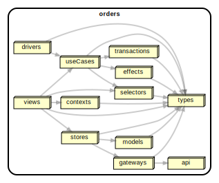
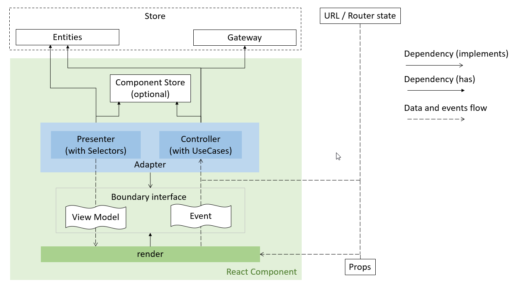

# CLEAN ARCHITECTURE FOR REACT APPLICATION WITH MOBX STORE

The repository provides an example React application that uses the Mobx state management library. The application is implemented based on [Clean Architecture](https://blog.cleancoder.com/uncle-bob/2012/08/13/the-clean-architecture.html).

## Definitions

- **Business Entity**: Unit that encapsulate business rules and data.
- **Business Rules and Data**: The most general and high-level rules and data that are presentation-agnostic. They are the least likely to change when something external changes.
- **Presentation (UI) Entity**: Unit that encapsulate presentation rules and data.
- **Presentation Rules and Data**: Rules and data that represent how the UI is currently displayed.
- **Store**: An aggregate unit with set of business and/or presentation entities and/or gateways and/or other stores.
- **State**: The value of a store, which is often an object.
- **Valid State**: One of a finite number of store values that is conceptually considered valid.
- **View Model**: The state transformed into a form required for presentation in a view (e.g. a React Component).
- **Gateway**: Unit that provides external services (stateful, switches services, maps data, caches data).
- **Selector**: Unit that derive additional values from that state as needed.
- **Transaction**: Unit with a logic that transitions a store between two valid states.
- **Effect**: Unit with a logic that communicates with external systems and services through a gateway.
- **Use Case**: Unit that orchestrates the flow of data to the store with the help of effects, transactions and selectors.
- **Controller**: An adapter unit that handles input from the view and converts it into a state change with the help of use cases (the public interface consists of methods decorated with `@action`).
- **Presenter**: An adapter unit that handles the state and converts it into view models for the view with the help of selectors (the public interface consists of getters decorated with `@computed`).

## Dependency Graphs

Dependency graph of the code units.

A more detailed dependency graph can be found [here](docs/images/dependency-graph-overview-1.svg).

Dependency graph, data and control flows inside a React component

